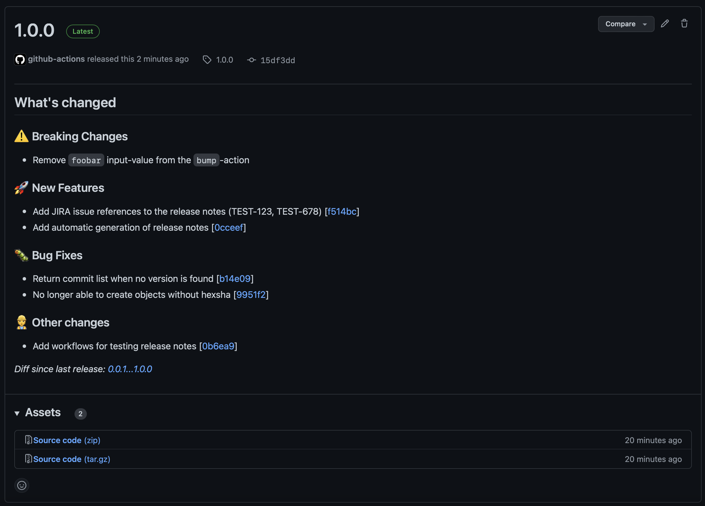

# Conventional Commit Messages
[](https://github.com/tomtom-international/commisery-action/releases/latest/download/commisery-linux-x64) [](https://github.com/tomtom-international/commisery-action/releases/latest/download/commisery-macos-arm64) [](https://github.com/tomtom-international/commisery-action/releases/latest/download/commisery-macos-x64)

This GitHub Action consists of two major components:

- Scan all commits in your Pull Request against the [Conventional Commits] standard
- Create GitHub Releases based on unreleased [Conventional Commits]

## Configuration parameters

You can configure `commisery-action` using a YAML-based configuration file, i.e.

```yaml
max-subject-length: 120
tags:
  docs: Documentation changes not part of the API
  example:
    description: Changes to example code in the repository
  perf:
    description: Performance improvements
    bump: true

disable:
  - C001
  - C018
enable:
  - C026
allowed-branches: "^ma(in|ster)$"
initial-development: false  # OPTIONAL, defaults to `true`
```

| Item | Default value |Description | 
| --- | --- | --- |
| `max-subject-length` | `80` | The maximum length of the subject of the commit message |
| `tags` | `fix`, `feat`, `build`, `chore`, `ci`, `docs`, `perf`, `refactor`, `revert`, `style`, `test`, `improvement` | Specify a custom list of Conventional Commit types to allow. If provided, this will overwrite the default list, so be sure to include those if you want to retain them.<br>`tags` takes a dict per type tag, with two values that can be set:<ul><li>`description`: a human-readable description of what the type should be used for.</li><li>`bump`: if set to `true`, will cause commits with this type to also bump the `PATCH` version component, same as `fix`.</li></ul>If you only specify YAML string, it shall be treated as the `description`; the `bump` will be `false` implicitly. <br><br>**NOTE:** The type tags `feat` and `fix` will automatically be provided. |
| `disabled` | `None` | List of rules to disable as part of the checker |
| `enabled` | `None` | List of rules to enable as part of the checker (some rules are disabled by default) |
| `allowed-branches` | `.*` | A regex specifying from which branch(es) releases and Git tags are allowed to be created |
| `initial-development` | `true` | A boolean indicating that this project is still under _initial development_. During this state, any commit message containing a breaking change will result in a `MINOR` version bump. |

> :bulb: By default `commisery-action` will search for the file `.commisery.yml`. 
You can specify a different file with the `config` input parameter.

## Command Line Interface

A stand-alone CLI tool is provided as part of the `commisery-action` package. We currently support
the following architectures:

- MacOS x86
- MacOS ARM64
- Linux x86

### Compliance Check

You can use the `check` command to validate your commit messages for compliance with Conventional Commits:

```sh
Usage: commisery check [options] [TARGET...]

Checks whether commit messages adhere to the Conventional Commits standard.

Arguments:
  TARGET      The `TARGET` can be:
    - a single commit hash
    - a file containing the commit message to check
    - a revision range that `git rev-list` can interpret
   When TARGET is omitted, 'HEAD' is implied.

Options:
  -h, --help  display help for command
```

#### (Pre-) Commit hook

You can use the CLI as a hook in Git to check messages you wrote by creating a `.git/hooks/commit-msg` file with these contents:

```sh
#!/bin/sh
exec commisery "$@"
```

### Configuration overview

You can validate your configuration file by running the `overview` command. This will provide a human-readable
overview of your configuration file;

```sh
Usage: commisery overview [options]

Lists the accepted Conventional Commit types and Rules (including description)

Options:
  -h, --help  display help for command
```

Please refer to the [Configuration parameters](#configuration-parameters) for more details.

## GitHub Actions integration

### Permissions

The following permissions are needed for full support of `commisery-action`:

| Permission | Level | Notes |
| --- | --- | --- |
| `pull-requests` | `write` | Needed for Pull Request validation and (optionally) when creating a GitHub Release |
| `contents` | `write`| Required in order to create tags and/or GitHub Releases |
| `issues` | `write` | Required to add labels to the associated Pull Request and/or issue |

> :bulb: You can lower the permissions (`pull-requests: read` and `issues: none`) in case you do not
require support for Issue/Pull Request labels.

Please refer to the GitHub documentation for the
[default permissions for your GitHub Token](https://docs.github.com/en/actions/security-guides/automatic-token-authentication#permissions-for-the-github_token)

### Check your Pull Request for Conventional Commit Compliance

The workflow, usually declared in `.github/workflows/conventional-commit.yml`, looks like:

```yml
name: Commisery
on:
  pull_request:

jobs:
  commit-message:
    name: Conventional Commit compliance
    runs-on: ubuntu-latest

    steps:
      - name: Check for compliance
        uses: tomtom-international/commisery-action@v2
        with:
          token: ${{ github.token }}
          validate-pull-request: true # OPTIONAL, default: `true`
          validate-commits: true # OPTIONAL, default: `true`
```

#### Issue Labels

The `commisery-action` will manage an issue label indicating the highest SemVer
version which will be bumped by its [release workflow](#create-github-releases-based-on-unreleased-conventional-commits):

| SemVer version | Issue Label |
| --- | --- |
| Major | `bump:major` |
| Minor | `bump:minor` |
| Patch | `bump:patch` |

> :warning: the action will replace *all* labels prefixed with `bump:` upon
running the validation step.

See [permissions](#permissions) for more details on the required GitHub token permissions.

#### Inputs

| Item | Mandatory | Description |
| --- | --- | --- |
| `token` | YES | GitHub Token provided by GitHub, see [Authenticating with the GITHUB_TOKEN] |
| `validate-pull-request` | NO | Includes the Pull Request title and description as part of the Conventional Commit validation (DEFAULT: `true`) |
| `validate-pull-request-title-bump` | NO | Ensures that the Pull Request title's version bump level matches that of its commits (implies `validate-pull-request`) (DEFAULT: `true`) |
| `validate-commits` | NO | Includes commits associated with the current Pull Request as part of the Conventional Commit validation (DEFAULT: `true`) |
| `config` | NO | Location of the Commisery configuration file (default: `.commisery.yml`)

> **NOTE**: This action will only function as part of the `pull_request` trigger for workflows.

#### Example of Conventional Commit check results


### Create GitHub Releases based on unreleased Conventional Commits

With the `/bump` GitHub Action, you can create a new Git tag or a GitHub release (also implicitly a Git tag),
based on the types of [Conventional Commits] since the latest found [Semantic Versioning]-compatible tag.
Breaking changes bump `MAJOR`, `feat`s bump `MINOR`, and `fix`es bump `PATCH`.
You may also specify additional types that bump `PATCH` using the [`tags.<tag>.bump`](#configuration-parameters)
configuration item.

Both the current and bumped versions are available as outputs.
Optional inputs can be provided to enable automatic tag or release creation when a bump is performed.
When running from a pull request event, tag/release creation is forcibly disabled, but the outputs are
still available.

Filtering the Git version tags is also possible, by providing a `version-prefix` input. If set, only tags matching
_exactly_ with the value of `version-prefix` shall be taken into account while determining and bumping versions.
As an example, for version tag `componentX-1.2.3`, the version prefix would be `componentX-`.

#### Initial Development

During initial development, you should avoid bumping the `MAJOR` version.
By default, we will bump the `MINOR` version for breaking changes in case:
- The current `MAJOR`-version is `0`
- **AND** the `initial-development` configuration parameter is `true` (default value)

We will automatically bump the version to `1.0.0` when:
- The current `MAJOR`-version is `0`
- **AND** the `initial-development` configuration parameter is `false`

> NOTE: This behavior also applies to non-bumping commits (ie. `chore:`, `ci:`)

#### GitHub Release Changelog
The GitHub releases will be automatically populated with a changelog based on the released Conventional
Commit messages, for example:



You can configure the content of your Changelog using the `release.y[a]ml` configuration file stored in `.github`, for ex.
```yaml
changelog:
  exclude:
    labels:
      - dependencies
  categories:
    - title: ⚠️ Breaking Changes
      labels:
        - bump:major
    - title: 🚀 New Features
      labels:
        - bump:minor
    - title: 🐛 Bug Fixes
      labels:
        - bump:patch
    - title: 📃 Documentation
      labels:
        - type:docs
    - title: 🚧 Other changes
      labels:
        - "*"
```

During generation, each individual conventional commit will associated with the following
labels:

| Label | Description |
| --- | --- |
| `bump:<version>` | The SemVer version to be bumped by this individual commit |
| `type:<type>` | Conventional Commit type associated with this commit message |

> **NOTE**: The `bump:<version>` and `type:<type>` labels set on your Pull Request will be
ignored in favor of individual commits

Please refer to the ["Automatically generated release notes"](https://docs.github.com/en/repositories/releasing-projects-on-github/automatically-generated-release-notes#configuring-automatically-generated-release-notes) documentation for more details

#### Example workflow
An example workflow that creates a release on every commit or merge to the `main` branch if necessary:

```yml
name: Bump version
on:
  push:
    branches: [ main ]

jobs:
  bump-version:
    name: Bump version and release
    runs-on: ubuntu-latest

    steps:
      - name: Release version
        id: release-version
        uses: tomtom-international/commisery-action/bump@v1
        with:
          token: ${{ github.token }}
          create-release: true              # OPTIONAL, default: `false`
          create-tag: false                 # OPTIONAL
          build-metadata: upstream-10.0.10  # OPTIONAL
          version-prefix: v                 # OPTIONAL
          config: .commisery.yml            # OPTIONAL

      - run: echo "Current version is ${{steps.release-version.outputs.current-version}}"

      - if: steps.release-version.outputs.next-version != ""
        run: echo "Version bumped to ${{steps.release-version.outputs.next-version}}
```

#### Inputs

| Item | Mandatory | Description |
| --- | --- | --- |
| `token` | YES | GitHub Token provided by GitHub, see [Authenticating with the GITHUB_TOKEN]|
| `create-release` | NO | Can optionally be set to `true` to create a GitHub release on version bump.|
| `create-tag` | NO | Can optionally be set to `true` to create a lightweight Git tag on version bump.|
| `build-metadata` | NO | Build metadata to add to the SemVer version on version bump.|
| `version-prefix` | NO | An optional prefix specifying the tags to consider, eg. `v`, `componentX-`, `""`.|
| `config` | NO | Location of the Commisery configuration file (default: `.commisery.yml`)|

> :bulb: Note that setting both `create-release` and `create-tag` to `true` is never needed, since a GitHub
release implicitly creates a Git tag.

#### Outputs
| Output | Description |
| --- | --- |
| `current-version` | The Semantic Version associated with the latest tag in the repository, stripped of any and all prefixes, or an empty string if the latest tag could not be parsed as a SemVer.
| `next-version` | The next version (including the optionally provided version-prefix) as determined from the Conventional Commits, or empty string if a version bump was not performed


[Conventional Commits]: https://www.conventionalcommits.org/en/v1.0.0/
[Commisery]: https://pypi.org/project/commisery/
[Authenticating with the GITHUB_TOKEN]: https://help.github.com/en/actions/automating-your-workflow-with-github-actions/authenticating-with-the-github_token
[GitHub context]: https://docs.github.com/en/actions/reference/context-and-expression-syntax-for-github-actions#github-context
