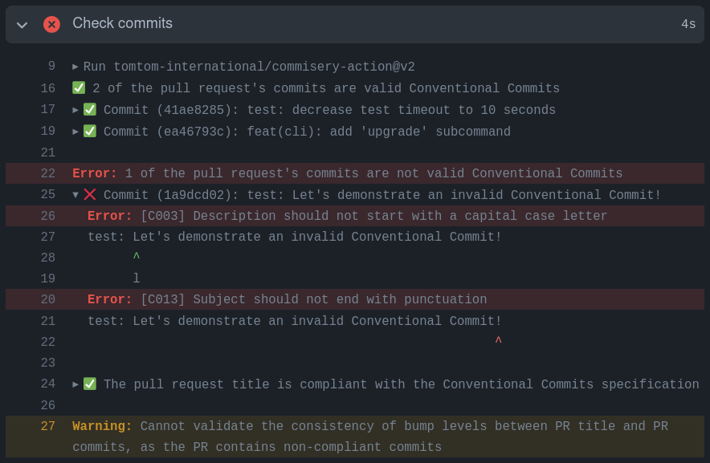

# Check your commits against Conventional Commits using Commisery

Using this GitHub action, scan all commits in your Pull Request against the [Conventional Commits]
standard using [Commisery]

## Prerequisites

* [Commisery] requires at least `Python>3.8`
* `pip` needs to be installed for this Python version 

## Usage

The workflow, usually declared in `.github/workflows/build.yml`, looks like:

```yml

    name: Commisery
    on: 
      pull_request:
        types: [edited, opened, synchronize, reopened]

    jobs:
      commit-message:
        name: Conventional Commit Message Checker (Commisery)
        runs-on: ubuntu-latest
        steps:       
        - name: Set-up Python 3.8
          uses: actions/setup-python@v3
          with:
            python-version: 3.8

        - name: Run Commisery
          uses: tomtom-international/commisery-action@master
          with:
            token: ${{ secrets.GITHUB_TOKEN }}
            pull_request: ${{ github.event.number }}
```

## Inputs

- **token**: GitHub Token provided by GitHub, see [Authenticating with the GITHUB_TOKEN]
- **pull_request**: Pull Request number, provided by the [GitHub context].
- **mode**: Validation mode, MUST be one of `full`, `pullrequest` or `commits`

## Example of Conventional Commit check results



[Conventional Commits]: https://www.conventionalcommits.org/en/v1.0.0/
[Commisery]: https://pypi.org/project/commisery/
[Authenticating with the GITHUB_TOKEN]: https://help.github.com/en/actions/automating-your-workflow-with-github-actions/authenticating-with-the-github_token
[GitHub context]: https://docs.github.com/en/actions/reference/context-and-expression-syntax-for-github-actions#github-context
