# SDK Versioning Strategy

> :warning: THIS IS AN EXPERIMENTAL FEATURE :warning:

SDK Versioning has been created to simplify the release workflow, allowing for hardening software
while employing trunk-based development;

- Semantic Versioning cannot reliably be used in environments where commitments are managed using
pre-planned increments (e.g. Product Increments in Scrum), whereas SDK Versioning allows you to
define a roadmap of (API-) releases, usable in public communication.

- Using Semantic Versioning on `main`, removes the ability to create pre-releases (hardening) based
on `HEAD`.
  
  *i.e. it is difficult to predict the upcoming version, required for applying the `pre-release`
  version without defining non-documented rules (i.e. `<MAJOR>.<MINOR>.<PATCH+1>-<PRERELEASE>`)*

- Typically, complex branching models are required for managing pre-releases using Semantic
Versioning (e.g. ["A successful Git branching model"](https://nvie.com/posts/a-successful-git-branching-model/)),
requiring maintenance of multiple branches (`develop`, `release`, `hotfix`, ...).

  With SDK Versioning, we simplify the semantics behind the `MINOR` (`RELEASE`) and `PATCH` (`FIX`)
  version, as used in Semantic Versioning, allowing management of pre-releases on a maximum of
  **two** branches: `main` and `release`.

- Conventional Commits will **only** apply to commits with `BREAKING CHANGES`.

It is important to define requirements for your product releases before selecting a versioning 
strategy. Applying either Semantic or SDK Versioning without careful consideration might lead
to unexpected complications.

## Version Schema
SDK Versioning (SdkVer) is resembles SemVer in form and precedence rules, but does not follow its semantics;

```js
<API>.<RELEASE>.<FIX>(-<PRERELEASE>)
```

| Item       | Description                                                  |
| ---------- | ------------------------------------------------------------ |
| `API`      | Version of the (public) API                                  |
| `RELEASE`  | Release number                                               |
| `FIX`      | Incremental number indicating incremental fixes on a release |

In addition, `PRERELEASE` can follow the following two release stages:
- [Development Releases](#development-releases): `-dev[N]`
- [Release Candidates](#release-candidates): `-rc[N]`

## Releases

There are three types of Releases supported by SdkVer:

- [Development Releases](#development-releases)
- [Release Candidates](#release-candidates)
- [Releases](#releases)

### Development Releases

A Development Release reflects the current state of the `main` development branch.
The representation of a Development Release is by the availability of a single
"draft" GitHub release, which is updated with every single commit on `main`.

This automatically implies that **no** git tags will be created for each Development Release.

The below table indicates the behavior when creating a Development Release:

| Current Version | Increment Type      | Next Version |
| --------------- | ------------------- | ------------ |
| `0.1.0`         | Non-breaking change | `0.2.0-dev1` |
| `0.2.0-dev1`    | Non-breaking change | `0.2.0-dev2` |
| `0.1.0`         | Breaking Change     | `1.0.0-dev1` |
| `0.2.0-dev1`    | Breaking change     | `1.0.0-dev2` |


### Release Candidates

It is possible to promote a Development Release to a Release Candidate. This should be used 
in case:
- Stabilization is needed before you want to release this version.
- Development on the `main` branch continued with changes not desired in the release

Each Release Candidate is represented by:
- a GitHub release (pre-release state), and
- an associated git tag on the specified commit.

A Release Candidate is initiated on the `main` development branch;

| Current Version | Increment Type      | Next Version |
| --------------- | ------------------- | ------------ |
| `0.1.0-dev1`    | Release Candidate   | `0.1.0-rc1`  |
| `0.1.0`         | Release Candidate   | `0.2.0-rc1`  |
| `0.1.0-rc1`     | Release Candidate   | `0.2.0-rc1`  |

Stabilizing a Release Candidate is handled on a release branch (i.e. `release/0.1`);

| Current Version | Increment Type      | Next Version |
| --------------- | ------------------- | ------------ |
| `0.1.0-rc1`     | Non-breaking change | `0.1.0-rc2`  |
| `0.1.0-rc2`     | Breaking change     | `0.1.0-rc3`  |

### Releases

Each Release is represented by:
- a GitHub release (pre-release state), and
- an associated git tag on the specified commit.

You can release both Development Releases and Release Candidates from either the `main` branch;

| Current Version | Increment Type      | Next Version |
| --------------- | ------------------- | ------------ |
| `0.1.0-dev1`    | Release             | `0.1.0`      |
| `0.1.0-rc1`     | Release             | `0.1.0`      |
| `0.1.0`         | Release             | `0.2.0`      |

or the `release` branch:

| Current Version | Increment Type      | Next Version |
| --------------- | ------------------- | ------------ |
| `0.1.0-rc2`     | Release             | `0.1.0`      |
| `0.1.0`         | Release             | `0.1.1`      |

Additionally, you can introduce additional fixes on a release by adding commits on a release branch
(i.e. `release/0.1`);

| Current Version | Increment Type      | Next Version |
| --------------- | ------------------- | ------------ |
| `0.1.0`         | Non-breaking change | `0.1.1`      |
| `0.1.0`         | Breaking change     | `0.1.1`      |


## Branching

Below you can find an example of common strategies which can be utilized using SdkVer:

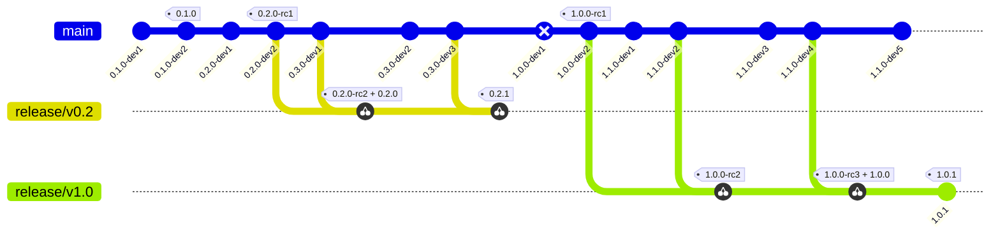

:warning: **Warning** :warning::

Creating a new release branch before the stabilization of a Release has been completed, has a risk of
unwillingly introducing breaking changes too early.

Instead, we propose to either:
- Create a new release branch just before the breaking changes got introduced in the `main` branch
- Or extend the lifetime of the last release before the breaking change.

# Work Instructions

This chapter contains a full walkthrough of the development- and release- workflows
which are supported by the SdkVer, including:

- Development
- Promotion:
  - Development to Release
  - Development to Release Candidate
  - Release Candidate to Release
- Hardening:
  - Release Candidate
  - Release

> **NOTE**: This chapter provides a _simplified way_ of creating branches, commits, pull requests, etc. 
>
>The goal is **not** to specify the way-of-working, rather explain how the SdkVer works.

## Preparing your environment

- Create a commisery configuration file in the root of your GitHub repository:

  `.commisery.yml`:
  ```yml
  version-scheme: "sdkver"              # Enable SdkVer strategy
  initial-development: false            # Allow BREAKING CHANGES to update the <API> version
  sdkver-create-release-branches: true  # Push a new release branch for rel- and RC-builds on main
  ```

- Add the following workflow to your repository:

  `.github/workflows/sdkver.yml`:
  ```yml
  name: Update SdkVer
  on:
    workflow_dispatch:
      inputs:
        releaseType:
          description: 'Release Type'
          required: true
          default: 'dev'
          type: choice
          options:
            - dev
            - rc
            - rel
    push:
      branches:
        - main
        - 'release/v**'

  concurrency: ${{ github.ref }}

  jobs:
    commisery-test:
      name: Update SdkVer
      runs-on: ubuntu-latest
      steps:
        # By default we will use the 'dev' release type
        - name: Set release type
          id: release
          run: |
            USER_INPUT=${{ github.event.inputs.releaseType }}
            echo "type=${USER_INPUT:-"dev"}" >> $GITHUB_OUTPUT

        - name: Update release
          uses: tomtom-international/commisery-action@v2
          with:
            token: ${{ github.token }}
            version-prefix: v                               # Adds the prefix `v` to the version (i.e. `v0.1.0`)
            release-type: ${{ steps.release.outputs.type}}  # Release Type
            create-release: true                            # Create a GitHub release
  ```


- Finally, install the [GitHub CLI](https://cli.github.com) for interacting with GitHub.

> **NOTE**: This chapter **assumes** that `main` is your main branch.

## Development flow

First we should ensure that we are on the `main` branch, updated against `HEAD` revision.

```sh
$ git checkout main
$ git pull
```

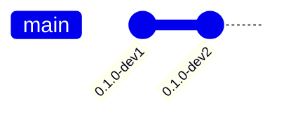

> **NOTE**: Above example already contains few earlier Development releases (`0.1.0-devN`)

Next, create a development branch:

```sh
$ git checkout -b feat/build-feature
```

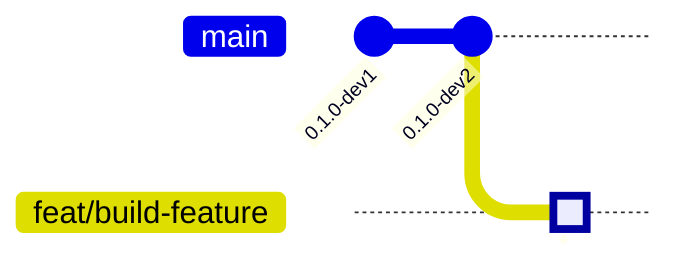

Initially, we need to push the locally created branch to the remote
```sh
$ git commit -m "fix: avoid memory corruption when restarting application" --allow-empty
$ git push --set-upstream origin feat/build-feature
```

Multiple commits can be added to the same branch;

```sh
$ git commit -m "feat(search): add \`setOption(...)\` API for specifying search criteria" --allow-empty
$ git push
```

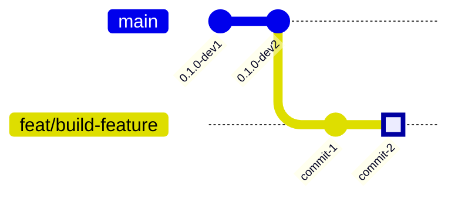

In the meantime, the `main` branch might have already advanced with additional changes;

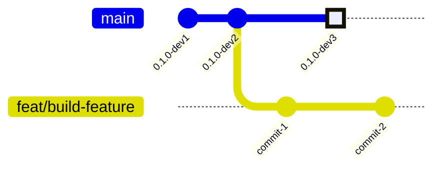

Once you are ready to deploy your changes, you simply create a Pull Request
```sh
# Creates a Pull Request based on the current branch and uses the commit information
# as default Pull Request title and description.
$ gh pr create --fill 
```

Once all review comments have been completed, you can merge your changes to `main`
```sh
# We will use merge commits for the sake of this example.
$ gh pr merge --merge
```

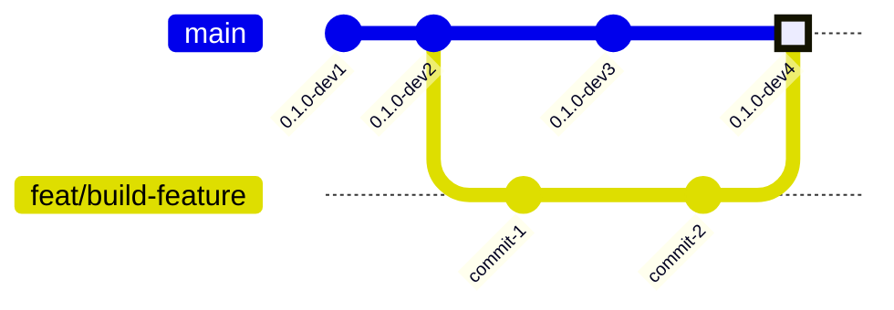

Once the Pull Request is merged, a new `draft` GitHub release (`v0.1.0-dev4`) will be created;

```sh
$ gh release list

TITLE           TYPE    TAG NAME      PUBLISHED
v0.1.0-dev4     Draft   v0.1.0-dev4   about 1 minute ago
```

## Release Candidate flow

### Promoting a Development Release to Release Candidate

Considering the current state:

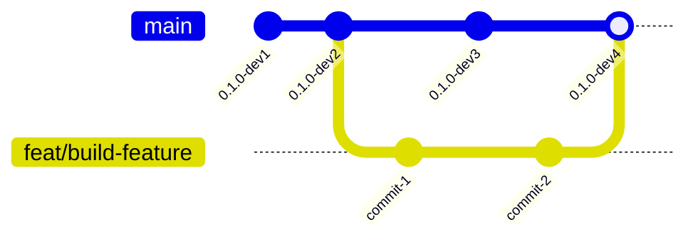

One can trigger a promotion of the latest Development Release to a Release Candidate by 
running the created worklow:

```sh
$ gh workflow run sdkver.yml --field releaseType=rc
```

This will create a new *tagged* GitHub release with the `pre-release` flag enabled:

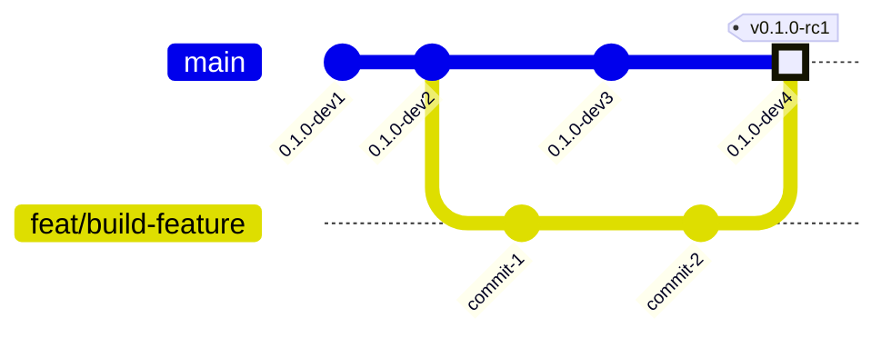

```sh
$ gh release list

TITLE           TYPE          TAG NAME      PUBLISHED
v0.1.0-rc1      Pre-release   v0.1.0-rc1    about 2 minutes ago
```

### Hardening a Release Candidate

Considering the following initial state:
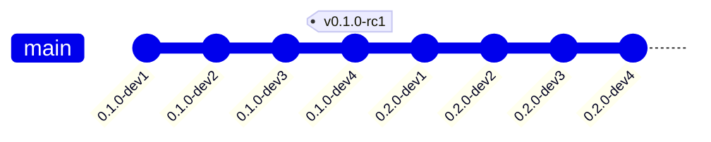

In order to harden a Release Candidate, one needs to:
- Create a `release`-branch based on the specified release candidate
- Either cherry pick a single commit, or rebase multiple changes

```sh
$ git checkout -b release/v0.1
$ git cherry-pick 0.2.0-dev2 # NOTE: This should be the SHA of 0.2.0-dev2
```

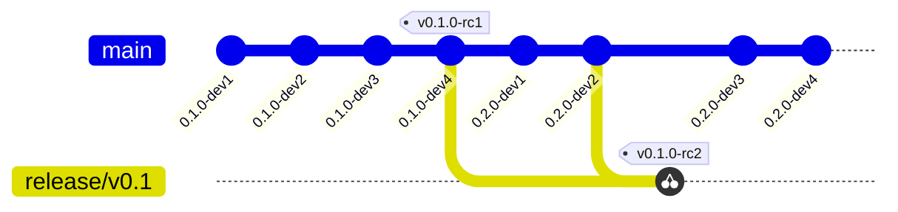

```sh
$ gh release list

TITLE           TYPE          TAG NAME      PUBLISHED
v0.1.0-rc2      Pre-release   v0.1.0-rc2    about 1 minute ago
v0.1.0-rc1      Pre-release   v0.1.0-rc1    about 13 minutes ago
```

## Release flow

### Promote Release Candidate to Release

Considering the following initial state:


Running the release workflow on the release branch...

```sh
# Ensure that we run the workflow from the release-branch
$ gh workflow run sdkver.yml --ref release/v0.1 --field releaseType=rel
```

...will result in a promotion towards a release:

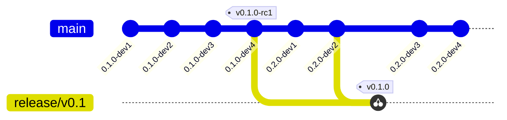

```sh
$ gh release list

TITLE           TYPE          TAG NAME      PUBLISHED
v0.1.0          Latest        v0.1.0        about 2 minutes ago
v0.1.0-rc2      Pre-release   v0.1.0-rc2    about 7 minute ago
v0.1.0-rc1      Pre-release   v0.1.0-rc1    about 20 minutes ago
```


### Promote Development Release to Release

Running the release workflow on `main`...

```sh
$ git checkout main
$ gh workflow run sdkver.yml --field releaseType=rel
```

...will result in a promotion of `v0.2.0-dev4` towards a release:

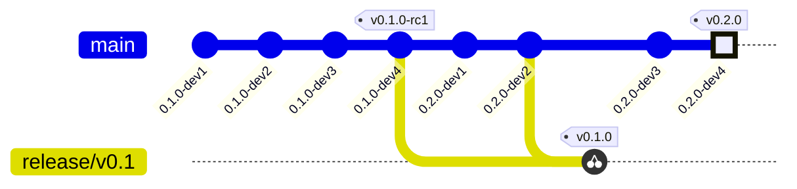

```sh
$ gh release list

TITLE           TYPE          TAG NAME      PUBLISHED
v0.2.0          Latest        v0.2.0        about 3 minutes ago
v0.1.0                        v0.1.0        about 5 minutes ago
v0.1.0-rc2      Pre-release   v0.1.0-rc2    about 10 minute ago
v0.1.0-rc1      Pre-release   v0.1.0-rc1    about 23 minutes ago
```


### Hardening a Release

You can harden the `v0.1.0` release by introducing additional fixes on the associated branch. This will result
in the next Release version:

```sh
$ git checkout release/v0.1
$ git cherry-pick 0.2.0-dev3 # NOTE: This should be the SHA of 0.2.0-dev3
```

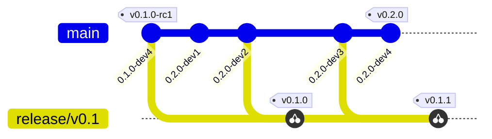

```sh
$ gh release list

TITLE           TYPE          TAG NAME      PUBLISHED
v0.1.1                        v0.1.1        about 1 minutes ago
v0.2.0          Latest        v0.2.0        about 3 minutes ago
v0.1.0                        v0.1.0        about 5 minutes ago
v0.1.0-rc2      Pre-release   v0.1.0-rc2    about 10 minute ago
v0.1.0-rc1      Pre-release   v0.1.0-rc1    about 23 minutes ago
```
