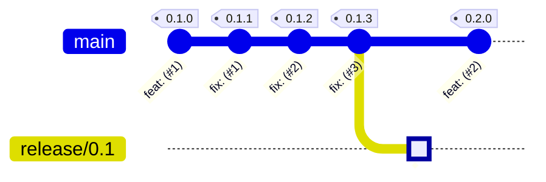
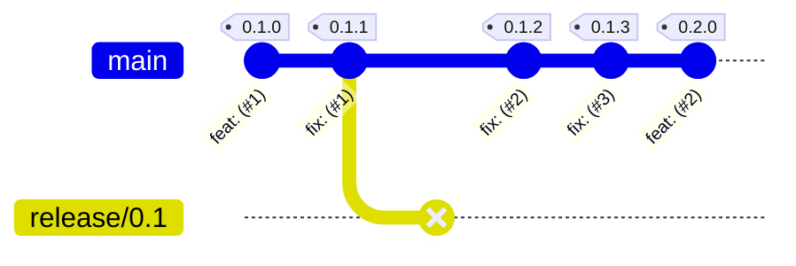
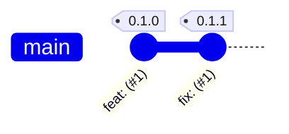
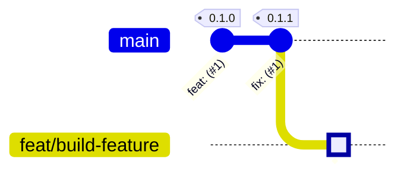
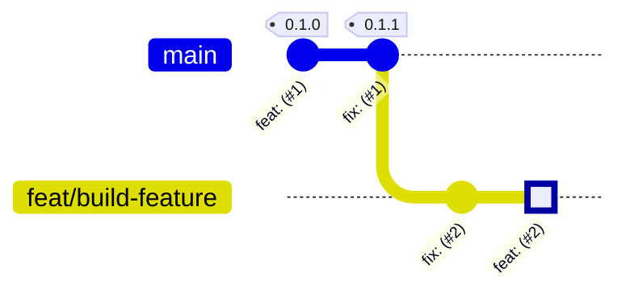
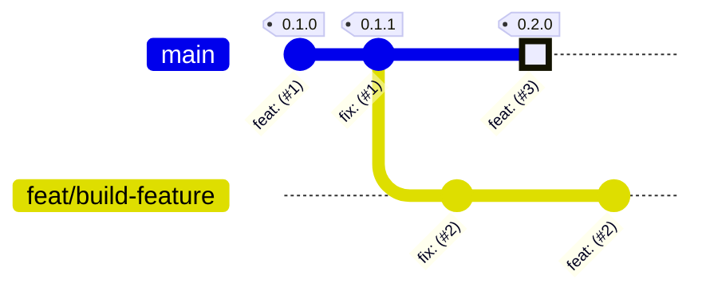
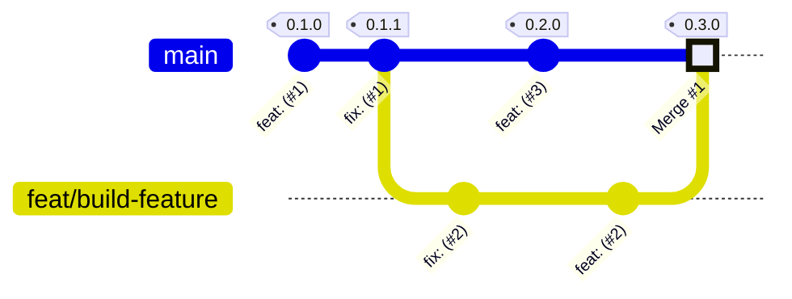

# Semantic Versioning Strategy

This strategy implements the [SemVer 2.0](https://semver.org) specification strictly,
versioning in accordance with [Conventional Commits](https://www.conventionalcommits.org/en/v1.0.0).

Summary as taken from [semver.org](https://semver.org/#summary):

> Given a version number `MAJOR`.`MINOR`.`PATCH`, increment the:
>
> - `MAJOR` version when you make incompatible API changes
> - `MINOR` version when you add functionality in a backwards compatible manner
> - `PATCH` version when you make backwards compatible bug fixes
>
> Additional labels for pre-release and build metadata are available as extensions to the `MAJOR`.`MINOR`.`PATCH` format.

## Versioning

We support the standard Conventional Commit behavior for incrementing SemVer:

| Type   | SemVer Increment | Description                              |
| ------ | ---------------- | ---------------------------------------- |
| `fix`  | `PATCH`          | Patches a bug in your codebase           |
| `feat` | `MINOR`          | Introduces a new feature to the codebase |

### Breaking Changes

By default, your product is considered to be in the [initial development](https://semver.org/#spec-item-4)
state if your current `MAJOR` version is `0`. During this phase, all `MAJOR` changes will
result in incrementing the `MINOR` version.

Once your API is considered "stable", we will move to a regular development flow in which
you can flag your commit as `BREAKING CHANGE`, incrementing `MAJOR`, by either:

- Adding an exclamation mark after your Conventional Commit type:
  
  ```
  feat!: this breaks the public API
  ```

- Adding `BREAKING CHANGE` to your Git trailer:

  ```
  feat: this breaks the public API

  BREAKING CHANGE: We have removed the `doIt(...)` API
  ```

Examples of the behavior of SemVer increment types:

| Current Version | Increment Type      | Next Version |
| --------------- | ------------------- | ------------ |
| `0.1.0`         | `PATCH`             | `0.1.1`      |
| `0.1.1`         | `MINOR`             | `0.2.0`      |
| `0.1.1`         | `MAJOR`             | `1.0.0`      |

## Branching (simplified)

You should create releases branches based on the last `PATCH` version before a
`MINOR` or `MAJOR` bump:

**Allowed:**


**Not allowed:**


In addition, we **prohibit** any version bump other than **PATCH** on `release`-branches:

| Current Version | Increment Type      | Next Version |
| --------------- | ------------------- | ------------ |
| `0.1.0`         | `PATCH`             | `0.1.1`      |
| `0.1.1`         | `MINOR`             | N/A          |
| `0.1.1`         | `MAJOR`             | N/A          |

> **NOTE**
>
> There are many different ways to manage hardening on released versions
(e.g. ["A successful Git branching model"](https://nvie.com/posts/a-successful-git-branching-model/)).
This document does not prescribe which model you should apply for your product.

# Work Instructions

This chapter contains a full walkthrough of the development- and release- workflows
which are supported, including:

- (Initial) Development
- Hardening

> **NOTE**
> 
> This chapter provides a _simplified way_ of creating branches, commits, pull requests, etc. 
>The goal is **not** to specify the way-of-working, rather explain how the SdkVer works.

## Preparing your environment

- Create a commisery configuration file in the root of your GitHub repository:

  `.commisery.yml`:
  ```yml
  version-scheme: "semver"    # Enable SemVer strategy
  initial-development: false  # Allow BREAKING CHANGES to update the <MAJOR> version
  ```

- Add the following workflow to your repository:

  `.github/workflows/semver.yml`:
  ```yml
  name: Update SemVer
  on:
    push:
      branches:
        - main
        - 'release/v**'

  concurrency: ${{ github.ref }}

  jobs:
    commisery-action:
      name: Update SemVer
      runs-on: ubuntu-latest
      steps:
        - name: Update version
          uses: tomtom-international/commisery-action@v2
          with:
            token: ${{ github.token }}
            version-prefix: v                               # Adds the prefix `v` to the version (i.e. `v0.1.0`)
            create-release: true                            # Create a GitHub release
  ```

> **NOTE**: This chapter **assumes** that `main` is your main branch.

## Development flow

First we should ensure that we are on the `main` branch, updated against `HEAD` revision.

```sh
$ git checkout main
$ git pull
```



Next, create a development branch:

```sh
$ git checkout -b feat/build-feature
```



Initially, we need to push the locally created branch to the remote
```sh
$ git commit -m "fix: avoid memory corruption when restarting application" --allow-empty
$ git push --set-upstream origin feat/build-feature
```

Multiple commits can be added to the same branch;

```sh
$ git commit -m "feat: add \`setOption(...)\` API for specifying search criteria" --allow-empty
$ git push
```



In the meantime, the `main` branch might have already advanced with additional changes;



Once you are ready to deploy your changes, you simply create a Pull Request
```sh
# Creates a Pull Request based on the current branch and uses the commit information
# as default Pull Request title and description.
$ gh pr create --fill 
```

Once all review comments have been completed, you can merge your changes to `main`
```sh
# We will use merge commits for the sake of this example.
$ gh pr merge --merge
```



Once the Pull Request is merged, the `MINOR` version is updated as your Pull Request
contained a `feat` Conventional Commit type.

```sh
$ gh release list

TITLE           TYPE    TAG NAME      PUBLISHED
v0.3.0          Latest  v0.3.0        about 1 minute ago
v0.2.0                  v0.2.0        about 3 minute ago
v0.1.1                  v0.1.1        about 5 minute ago
v0.1.0                  v0.1.0        about 9 minute ago
```
